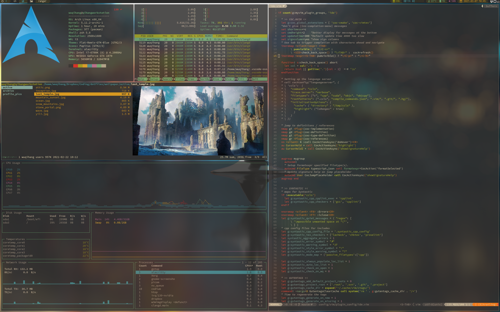
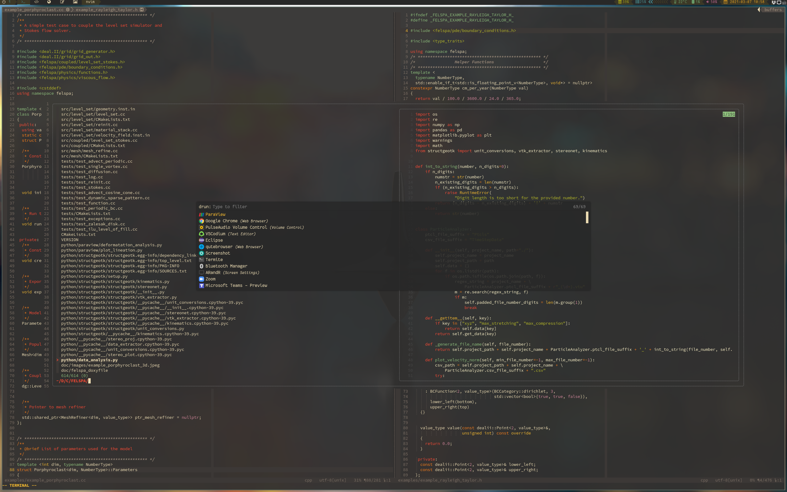

# Dotfiles
 
 

## Dependencies
* autorandr
* alacritty
* bat
* ccls
* blueman
* dunst
* feh
* htop
* i3-gaps
* lxappearance
* mpd + mpc + ncmpcpp
* neofetch
* networkmanager, nm-connection-editor, network-manager-applet 
* picom
* papirus-icon-theme
* polybar
* pplatex
* pulseaudio, pulseaudio-bluetooth
* qpdfview
* qutebrowser, pdfjs
* qt5ct
* ranger, atool, w3m
* redshift
* rofi
* tmux
* thunar, gvfs
* udiskie
* vim
* vimiv
* vscodium
* xdg-user-dirs-update
* xdotool (for vimtex forward/backward search)
* zathura
* zsh

## Fonts (AUR)
* nerd-fonts-source-code-pro
* nerd-fonts-fantasque-sans-mono 
* ttf-font-awesome-4

